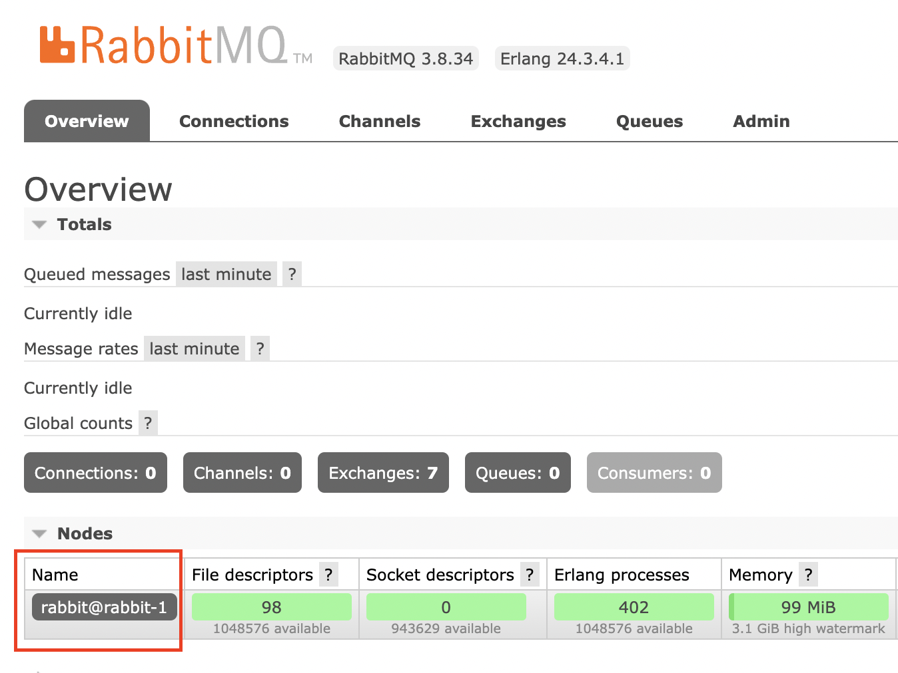

# RabbitMQ Clustering Basics

[Official RabbitMQ Clustering Guide](https://www.rabbitmq.com/clustering.html)

RabbitMQ nodes are identified by node names. A node name consists of two parts, a prefix (usually `rabbit`) and hostname. For example, `rabbit@rabbit-1` is a node name with the prefix of `rabbit` and hostname of `rabbit-1`.

To ensure our rabbitmq hosts can resolve DNS names of other rabbitmq hosts in a cluster, we're going to create a custom docker network named `rabbits` that all our hosts will live in.

```bash
docker network create rabbits
```

Now let's create our first container

```bash
docker run -d --rm --net rabbits --hostname rabbit-1 --name rabbit-1 rabbitmq:3.8
```

In a RabbitMQ cluster, the Erlang Cookie is used for the CLI to authenticate with our nodes, but it's also used for nodes to authenticate with each other.

To get the Erlan Cookie from a running RabbitMQ docker container:

```bash
docker exec -it rabbit-1 cat /var/lib/rabbitmq/.erlang.cookie
```

To clean up:

```bash
docker stop rabbit-1
```

# Manual RabbitMQ Clustering

## Creating Nodes

Let's create 3 nodes to use in our RabbitMQ cluster.

```bash
for x in {1..3}; do
	docker run -d --rm --net rabbits \
    --hostname rabbit-"$x" --name rabbit-"$x" \
    -p 808"$x":15672 -e RABBITMQ_ERLANG_COOKIE=BONNKACVCFMBMHXDEOFA \
    rabbitmq:3.8-management
done
```

Here's an explanation of the options

* `for x in {1..3}` - Loops 3 times, setting `"$x"` to 1, 2, then 3.
* `-d` - Run docker in detached mode
* `--rm` - Delete the container after it's been stopped
* `--net rabbits` - Attach this container to the `rabbits` network
* `--hostname rabbit-"$x" --name rabbit-"$x"` - Set the hostname and container name to `rabbit-"$x"`
* `-p 808"$x":15672` - Expose the management port to access the web interface.
* `-e RABBITMQ_ERLANG_COOKIE=BONNKACVCFMBMHXDEOFA` - Specify that every node use the same erlang cookie, this is important for the nodes to authenticate with each other.
* `rabbitmq:3.8-management` - The docker image to use. In this case we want rabbitmq with the management web interface installed and running.

Now we can log into the management web portal for all three using the default username `guest` and password `guest`.

* [rabbit-1](http://localhost:8081/)
* [rabbit-2](http://localhost:8082/)
* [rabbit-3](http://localhost:8083/)

We can see on the overview page that they're all running single node instances and aren't clustered yet.



We can also confirm this from the command line by running the `rabbitmqctl` command:

```bash
docker exec -it rabbit-1 rabbitmqctl cluster_status
```

## Joining Nodes

If any existing nodes need to join a cluster, they will lose all the data they have stored. So we need to run the reset command on these nodes first. In our examples, nodes 2 and 3 will be joing node 1's cluster, so they will be reset.

To add nodes 2 and 3 to the node 1 cluster:

```bash
for x in 2 3; do
  docker exec -it rabbit-"$x" rabbitmqctl stop_app
  docker exec -it rabbit-"$x" rabbitmqctl reset
  docker exec -it rabbit-"$x" rabbitmqctl join_cluster rabbit@rabbit-1
  docker exec -it rabbit-"$x" rabbitmqctl start_app
  docker exec -it rabbit-"$x" rabbitmqctl cluster_status
done
```

To clean up:

```bash
docker stop rabbit-{1..3}
```

# Automatic RabbitMQ Clustering

In order to automatically cluster our RabbitMQ nodes, we need to start up our containers slightly differently:

```bash
for x in {1..3}; do
  docker run -d --rm --net rabbits \
    --hostname rabbit-"$x" \
    --name rabbit-"$x" \
    -p 808"$x":15672 \
    -v "$(pwd)"/config/rabbit-"$x"/:/config/ \
    -e RABBITMQ_CONFIG_FILE=/config/rabbitmq \
    -e RABBITMQ_ERLANG_COOKIE=BONNKACVCFMBMHXDEOFA \
    rabbitmq:3.8-management
done
```

The only difference with this version of the command is that it mounts the `./config/rabbit-"$x"` config folder and points RabbitMQ to it to automate clustering.

After running the command above, you should see all the nodes start up and cluster automatically.
