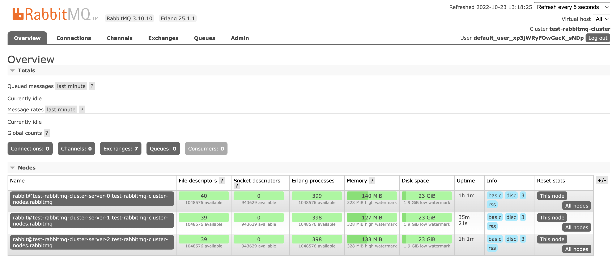

# RabbitMQ Cluster Operator

The cluster operator uses the kubernetes operator pattern to simplify RabbitMQ cluster management inside of kubernetes. By installing the operator, a RabbitMQ cluster can be created with a single succinct k8s config file with the object type `RabbitmqCluster`. Here's a simple hello, world example from the [quick start guide][quickstart]:

```yaml
apiVersion: rabbitmq.com/v1beta1
kind: RabbitmqCluster
metadata:
    name: hello-world
```

## Installing

In the official [operator install guide][operatorinstall], it lists several ways to install the operator in k8s, but the most standard and maintainable way (in my opinion) is to use the binami helm chart:

```bash
helm repo add bitnami https://charts.bitnami.com/bitnami
helm install test bitnami/rabbitmq-cluster-operator --namespace rabbitmq --create-namespace
```

## Creating a RabbitMQ cluster

Now that the operator is installed, let's create a RabbitMQ cluster using the `rabbitmq-cluster.yml` config file.

```bash
kubectl apply -f rabbitmq-cluster.yml --namespace rabbitmq
```

This will spin up a 3 RabbitMQ pods and automatically cluster them together.

To verify this, we can port forwarding the management UI interface.

```bash
kubectl port-forward pod/test-rabbitmq-cluster-server-0 15672:15672 -n rabbitmq
```

Now you can open the [management interface](http://127.0.0.1:15672/) locally. To get the username and password, we need to decode the k8s secret `username` and `password`:

```bash
# username
kubectl get secret test-rabbitmq-cluster-default-user -n rabbitmq -o jsonpath='{.data.username}' | base64 --decode
# password
kubectl get secret test-rabbitmq-cluster-default-user -n rabbitmq -o jsonpath='{.data.password}' | base64 --decode
```

Now we see the 3 nodes listed in the cluster:



## References

[quickstart]: https://www.rabbitmq.com/kubernetes/operator/quickstart-operator.html	"RabbitMQ Cluster Operator Quick Start"

[operatorinstall]: https://www.rabbitmq.com/kubernetes/operator/install-operator.html "Installing RabbitMQ Cluster Operator in a Kubernetes Cluster"